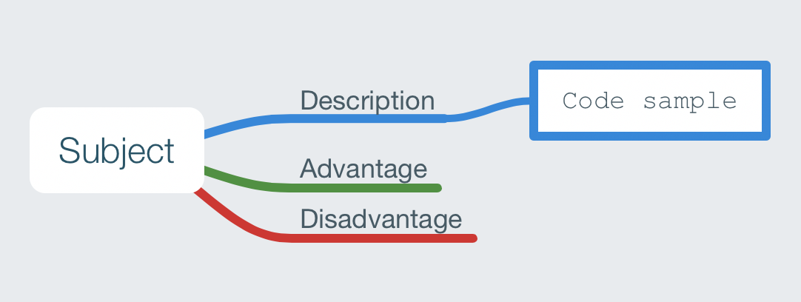
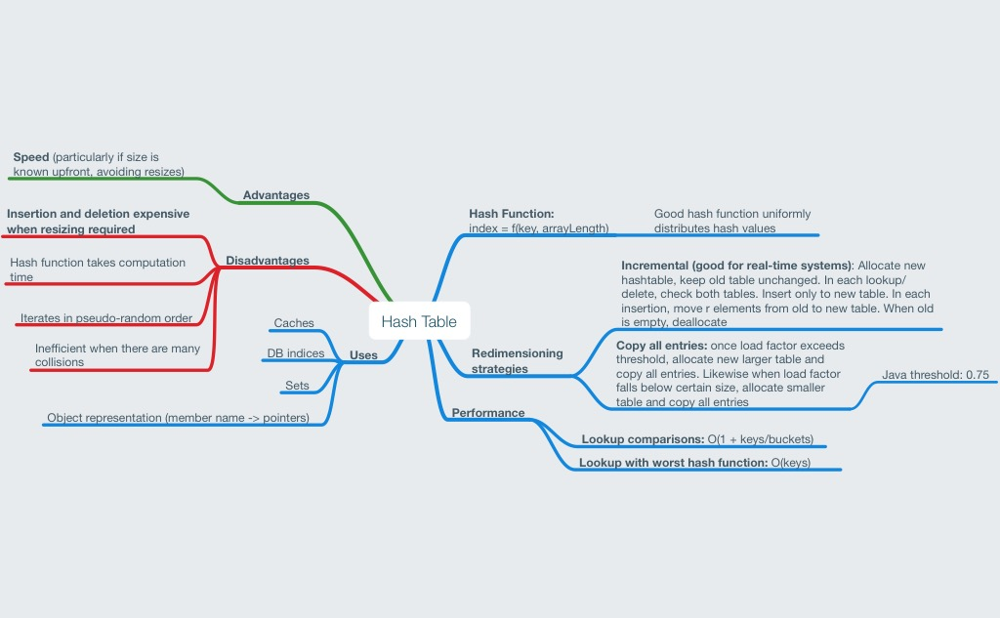

[Mindnode](https://mindnode.com) mind maps to aid learning data structures

See also: [mindmaps-scala-java](https://github.com/chrisbeach/mindmaps-scala-java)

A work in progress - pull requests gladly accepted.

### Key

## Hash Tables

## Graph Data Structures

## AVL Tree

## Trie Tree

